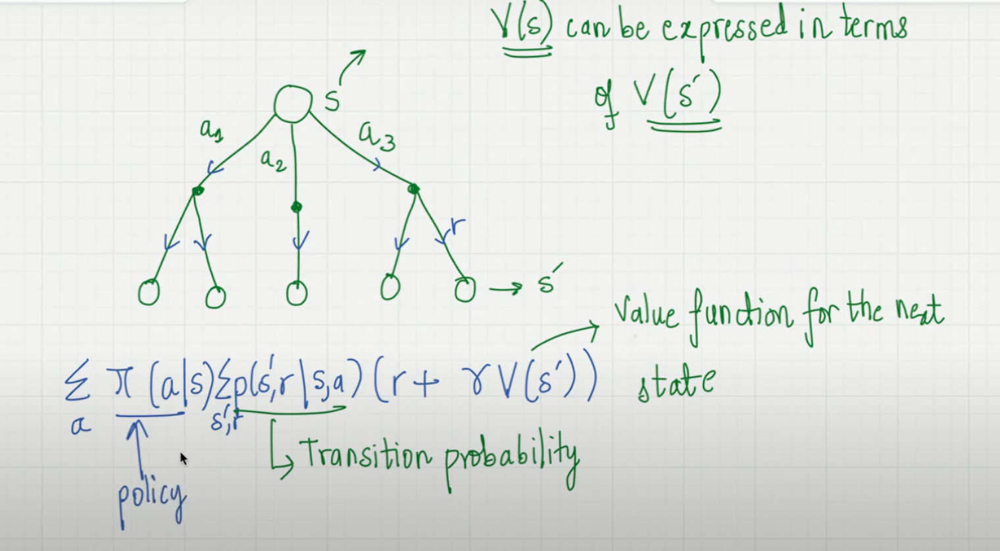

### Value Functions

- The MOST important.
- Reward is immediate, value is long term reward. If a player doesnt play in good in first 2 matches, it doesnt mean it is bad. Overall reward for entire tournament will be good since the player has some value.

1. **State Value Function-**

   - Summing up all the rewards from state to the goal, and we get value of the state.
   - Denoted by $V_{\pi}(s)$, which means, on the state of s, if an agent uses \pi policy, it will have value of V.

   $V_{\pi}(s)=E_{\pi}(G(t)|S_t=s)$

   - This means, Total expected return given the state, we get the value of the state if we apply policy function $\pi$. It can be extended to-

   $V_{\pi}(s)=E_{\pi}(\sum_{k=0}^{\infty}(\gamma)^kR_{t+k+1}|S_t=s)$

   - Since $G_t=R_{t+1}+(\gamma)R_{t+2}+(\gamma)^2R_{t+3}+...$

2. **Action value function-**

   - This indicates that what would be the value based on the action taken and reward gained at each iteration.
   - Every action taken (there are multiple options), will lead to a value and this is exactly what Action Vlaue function is.
   - Denoted by-
     $q_{\pi}(s,a)$ This means that Value doesnt only depend on state but both state and action.

   $V_{\pi}(s)=E_{\pi}(G(t)|S_t=s, A_t=a)$

   - And hence,

   $V_{\pi}(s)=E_{\pi}(\sum_{k=0}^{\infty}(\gamma)^kR_{t+k+1}|S_t=s, A_t=a)$

   - 
   - The above is the bellman's equation! It state that we can show value function of S in terms of value function of $S^l$ for each state based on each actions possible.

3. **Optimal Policy-**

   - This is something that can be called as the "GOal".
   - We are trying to achieve optimal policy which means the value function is maximised. A policy $\pi > \pi^l$ ONLY if the Value function of $\pi$ is greater than or equal to that of $\pi^l$. The same goes with Action value function as well.

   - $V_*(s)_{aEA}=max q_{\pi^*}(s,a)$
   - Above is maximizing action value function which results into maximizing state value function, then the policy used is optimal poliicy.
   - Below is the **Bellman's Optimality Function**-

   $V_*(s)=max_{aEA}\sum_{s^l,a}\rho(s^l,a|s,a)(r+\gamma V_*(s^l))$

   - The above equation is what we call `Optimal Value`.
