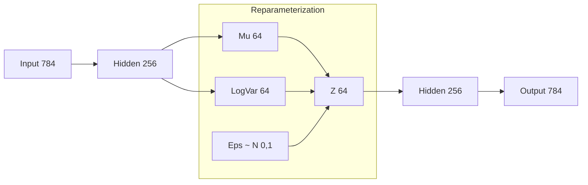

# Variational Autoencoder (VAE)

Variational Autoencoders are a cornerstone of modern Deep Learning, serving as a critical standalone architecture and a prerequisite for understanding state-of-the-art **Deep Generative Models** like **Diffusion Models** and **Stable Diffusion**.

---

## 1. Context & Importance

Why study VAEs now?
1. **Standalone Significance**: VAEs teach fundamental concepts about latent space representation and probabilistic mapping.
2. **Generative Foundation**: If you want to understand Stable Diffusion, you must first master Variational Autoencoders.
3. **Compression with Logic**: While standard Autoencoders (AE) focus on pure compression, VAEs focus on creating a **regularized latent space** suitable for generation.

---

## 2. Recap: Standard Autoencoder (AE)

Before diving into VAEs, recall the basic logic of an Autoencoder:

### The Architecture
Imagine an image of $28 \times 28$ pixels (784 dimensions).
- **Encoder**: Projects the 784-dimensional input into a significantly smaller space (e.g., 10, 32, or 64 dimensions).
- **Latent Space**: A compressed representation containing the core information of the input.
- **Decoder**: Attempts to decompress the latent vector back into the original 784-dimensional space.

### Validation via Reconstruction
We know the compression is "valid" if the **Reconstructed Image** looks almost identical to the **Input Image**. If the decoder can recreate the image from just 64 numbers, those 64 numbers must be a highly efficient summary of the data.

```
Input (784) --> [Encoder] --> Latent (64) --> [Decoder] --> Output (784)
```

---

## 3. The Problem with Regular Autoencoders

The primary issue with standard AEs is that their latent space is **"Irregular and Disorganized."**

### Hard Training
A standard AE maps one input image to one specific "hard-coded" point in the latent space. Because we use **Mean Squared Error (MSE)** to force the reconstruction to be exact, the model becomes too rigid.

### The Gibberish Problem
If you pick a random vector from the latent space of a trained AE and pass it through the decoder, you will almost certainly get **gibberish**. 
- The decoder only knows how to handle the specific points assigned by the encoder during training.
- There is no guarantee that a point *between* two valid latent vectors (like between a "5" and a "3") will represent something meaningful (like a "6").

> [!WARNING]
> While AE latent spaces show clusters (e.g., all "1s" near each other), the spaces *between* those clusters are empty or meaningless to the decoder.

---

## 4. Variational Autoencoder (VAE) Logic

VAEs solve the irregularity problem by performing **Probabilistic Mapping**. Instead of mapping an input to a single point, it maps it to a **Distribution**.

### The Mu and Sigma Layers
In a VAE, the encoder predicts two parameters for every input image:
1. **$\mu$ (Mean)**: The center of the distribution.
2. **$\sigma$ (Standard Deviation)**: The spread or variance of the distribution.

> [!NOTE]
> In practice, neural networks are often tasked with predicting **Log Variance** ($\log \sigma^2$) instead of $\sigma$ directly. This is because $\sigma$ must be positive, but a neuron's output is unbounded. Predicting the log allows the network to use the full range of real numbers, which are then converted back to positive values via $exp(\cdot)$.

### Sampling the Latent Space
For every forward pass, we sample a random point $z$ from the resulting distribution $N(\mu, \sigma^2)$. This $z$ is what the decoder uses for reconstruction.

---

## 5. The Reparameterization Trick

Sampling is inherently **non-differentiable**, which breaks **Backpropagation**. If we randomly pick a point, the "randomness" has no gradient.

### The Solution
We use the **Reparameterization Trick**:
$$z = \mu + \epsilon \cdot \sigma$$
Where $\epsilon \sim N(0, 1)$ (a standard normal distribution).

- **Why this works**: By moving the randomness to $\epsilon$ (an external constant), the latent vector $z$ becomes a deterministic, differentiable function of $\mu$ and $\sigma$. We can now backpropagate gradients through the network.

---

## 6. Mathematical Foundation & Loss Function

A VAE is penalized for two things, leading to a dual-term loss function:

### 1. Reconstruction Loss (MSE/BCE)
Same as AE; we want the output image to resemble the entry image. 
> For grayscale images like MNIST (pixels 0-1), **Binary Cross Entropy (BCE)** or **MSE** can be used.

### 2. KL Divergence (Regularization)
This term forces the predicted distribution $N(\mu, \sigma)$ to be as close as possible to a **Standard Normal Distribution** $N(0, 1)$.

**Gaussian Distribution Formula used for derivation**:
$$\mathcal{N}(x \mid \mu, \sigma^2) = \frac{1}{\sqrt{2\pi\sigma^2}} \exp\left(-\frac{(x - \mu)^2}{2\sigma^2}\right)$$

**Standard KL Divergence Formula**: 
$$D_{KL}(P \parallel Q) = \int P(x) \log \left( \frac{P(x)}{Q(x)} \right) dx$$

**The Gaussian KL Formula:** (Ask GPT for derivation, its straightforward)
$$\text{KL}(N(\mu, \sigma^2) \parallel N(0, 1)) = \frac{1}{2} \sum \left( \mu^2 + \sigma^2 - \log(\sigma^2) - 1 \right)$$

### Why KL Divergence?
- **Smoothness**: Without KL, the network might set $\sigma \approx 0$ to avoid noise, essentially turning back into a standard AE.
- **Centering**: KL forces the entire latent space to stay centered around the origin ($0$), ensuring that different digit distributions overlap. This overlap forces the decoder to learn "interpolations" between digits, making the latent space **regular and continuous**.

---

## 7. Architecture & Activations

A concrete example for MNIST ($28 \times 28$):



### Activation Choices
- **Hidden Layers**: **ReLU** is used for expressive power.
- **Output Layer**: **Sigmoid** is mandatory if pixel values are normalized between [0, 1]. It ensures the reconstructed pixels remain within valid bounds.

### The Blurring Effect
VAEs often produce slightly **blurry** reconstructions compared to GANs. This is because the Gaussian sampling "averages out" sharp edges in the latent space, acting like a natural smoothing filter.

---

## 8. Generative Capability

VAEs are **True Generative Models**. After training, you can throw away the encoder:
1. Sample a random vector from $N(0, 1)$.
2. Pass it through the decoder.
3. Result: A completely new, realistic image that never existed in the training set.

| Feature | Autoencoder (AE) | Variational Autoencoder (VAE) |
| :--- | :--- | :--- |
| **Mapping** | Deterministic (Point) | Probabilistic (Distribution) |
| **Latent Space** | Irregular, Sparse | Regular, Continuous |
| **Primary Goal** | Compression / Denoising | Generation / Latent Modeling |
| **Generative Power** | Poor (Gibberish) | High (Realistic new samples) |
| **Loss** | MSE | MSE + KL Divergence |

---

## 9. Summary

1. **Autoencoders** are great for compression but bad for generation.
2. **VAEs** map inputs to spaces of probability distributions.
3. **Reparameterization** makes sampling differentiable for training.
4. **KL Divergence** regularizes the latent space to a standard normal $N(0, 1)$.
5. **Generative Power**: VAEs can generate new images by sampling from the latent prior.
6. **Prerequisite**: Understanding VAEs is the gateway to **Diffusion Models**.

---

## Code Reference
For a complete PyTorch implementation starting from scratch, see:
- [Autoencoders.py](file:///c:/Users/kunjs/OneDrive/Projects/llms-from-scratch/docs/ml-and-dl/AutoEncoder/Autoencoders.py)
