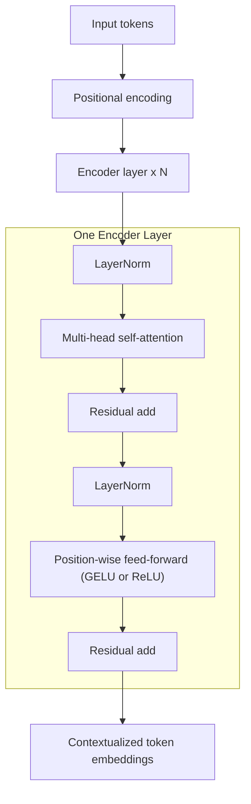

# Transformer **Encoder** — Quick, Visual, and Practical Guide

<details>
<summary>📊 Visual (click to expand)</summary>



</details>

---

**Good references with diagrams:**

- “Attention Is All You Need” (Vaswani et al., 2017): [https://arxiv.org/abs/1706.03762](https://arxiv.org/abs/1706.03762)
- The Illustrated Transformer (Jay Alammar): [https://jalammar.github.io/illustrated-transformer/](https://jalammar.github.io/illustrated-transformer/)
- BERT (Devlin et al., 2018): [https://arxiv.org/abs/1810.04805](https://arxiv.org/abs/1810.04805)
- RoBERTa (Liu et al., 2019): [https://arxiv.org/abs/1907.11692](https://arxiv.org/abs/1907.11692)
- Sentence-BERT (Reimers & Gurevych, 2019): [https://arxiv.org/abs/1908.10084](https://arxiv.org/abs/1908.10084)

---

## 🔩 What’s Inside the Encoder?

| Component                     | Purpose (1-liner)                                             |
| ----------------------------- | ------------------------------------------------------------- |
| Token + Positional Encoding   | Converts tokens to vectors and injects order.                 |
| Multi-Head **Self-Attention** | Lets each token attend to all others.                         |
| Residual Connections          | Stabilize and speed up training.                              |
| LayerNorm                     | Normalize per token for stable gradients.                     |
| Feed-Forward Network (FFN)    | Non-linear mixing per token (two linear layers + activation). |
| Dropout                       | Regularization during training.                               |

---

## ⚙️ How the Encoder Works (Tiny, stepwise)

1. **Embed** tokens → add **positional encodings**.
2. **Self-attention** across the sequence (multi-head → concat → linear).
3. **Residual + LayerNorm** around attention.
4. **FFN** per token (e.g., Linear → GELU → Linear).
5. **Residual + LayerNorm** around FFN.
6. Stack **N** identical layers → output **contextualized embeddings**.

---

## 🧪 Training the Encoder (Common Objectives)

| Objective                          | Typical Setup                                 | Where It’s Used                  |
| ---------------------------------- | --------------------------------------------- | -------------------------------- |
| **MLM (Masked Language Modeling)** | Mask \~15% tokens, predict them               | BERT/RoBERTa pretraining         |
| **Denoising / Span Corruption**    | Corrupt spans, reconstruct                    | T5-style encoders (encoder side) |
| **Contrastive**                    | Pull positives together, push negatives apart | Sentence/Document embeddings     |
| **Supervised Classification**      | \[CLS] (or pooled) → classifier head          | Finetuning for tasks             |
| **Multi-Task**                     | Mix of above                                  | Robust general encoders          |

**Practical links:**

- BERT pretraining (MLM + NSP): [https://arxiv.org/abs/1810.04805](https://arxiv.org/abs/1810.04805)
- RoBERTa (removes NSP, scales data): [https://arxiv.org/abs/1907.11692](https://arxiv.org/abs/1907.11692)
- SimCSE / Contrastive: [https://arxiv.org/abs/2104.08821](https://arxiv.org/abs/2104.08821)

---

## 🆚 Encoder vs. Decoder (And Why Encoders Shine for Representations)

| Aspect         | **Encoder**                                   | **Decoder**                               |
| -------------- | --------------------------------------------- | ----------------------------------------- |
| Attention      | **Self-attention (bidirectional)**            | **Causal self-attention (left-to-right)** |
| Visibility     | Sees **full** input at once                   | Sees **past** tokens only                 |
| Best at        | **Understanding / representations**           | **Generation / next-token**               |
| Pretraining    | MLM / Denoising / Contrastive                 | Causal LM (predict next token)            |
| Typical Output | Token-wise contextual vectors / pooled vector | Next token distribution                   |
| Example Models | BERT, RoBERTa, DeBERTa, MiniLM                | GPT-x, LLaMA-x, Mistral                   |

---

## 🛠️ Minimal Encoder Block (PyTorch-style pseudocode)

```python
class EncoderLayer(nn.Module):
    def __init__(self, d_model, n_heads, d_ff, p=0.1):
        super().__init__()
        self.ln1 = nn.LayerNorm(d_model)
        self.attn = nn.MultiheadAttention(d_model, n_heads, batch_first=True)
        self.dropout1 = nn.Dropout(p)
        self.ln2 = nn.LayerNorm(d_model)
        self.ffn = nn.Sequential(
            nn.Linear(d_model, d_ff),
            nn.GELU(),
            nn.Linear(d_ff, d_model),
        )
        self.dropout2 = nn.Dropout(p)

    def forward(self, x, attn_mask=None):
        # Self-attention (pre-norm)
        h = self.ln1(x)
        a, _ = self.attn(h, h, h, attn_mask=attn_mask, need_weights=False)
        x = x + self.dropout1(a)

        # FFN (pre-norm)
        h = self.ln2(x)
        x = x + self.dropout2(self.ffn(h))
        return x
```

---

## 🧭 How to Train (At a Glance)

| Step           | What to do                                                 |
| -------------- | ---------------------------------------------------------- |
| Data           | Large unlabeled text corpus (for pretraining).             |
| Tokenizer      | WordPiece/BPE (e.g., SentencePiece).                       |
| Objective      | Choose **MLM** (encoders) or **contrastive** (embeddings). |
| Schedule       | Warmup → cosine/linear decay; mixed precision.             |
| Regularization | Dropout, weight decay, gradient clipping.                  |
| Eval           | Dev losses + task probes (classification/STS/IR).          |
| Finetune       | Add small task head or do pooling + contrastive.           |

---

## 🧩 Ten Things an **Encoder** Can Do (Names Only)

1. **Topic Classification (Text Classification)**
2. **Sentiment Analysis (Text Classification)**
3. **Intent Detection (Text Classification)**
4. **Toxicity Detection (Text Classification)**
5. **Emotion Classification (Text Classification)**
6. **Semantic Textual Similarity (Embedding/Ranking)**
7. **Dense Passage Retrieval (Embedding/IR)**
8. **Entity Linking (Embedding/Matching)**
9. **Clustering of Documents (Embedding/Analytics)**
10. **Cross-lingual Retrieval (Embedding/Multilingual)**

_(Per your request: kept them as names only; excluded “spam/not spam.”)_

---

## 🧱 Pooling Cheat-Sheet (to get a single vector)

| Method                    | Note                                  |
| ------------------------- | ------------------------------------- |
| **\[CLS] token**          | Common for BERT-style classification. |
| **Mean-pool over tokens** | Strong baseline for embeddings.       |
| **Max-pool**              | Sometimes robust to noise.            |
| **Attention-pool**        | Learnable weighted pooling.           |

---

## 🔗 Handy Repos & Recipes

- **Hugging Face Transformers** (encoders, training scripts): [https://github.com/huggingface/transformers](https://github.com/huggingface/transformers)
- **Sentence-Transformers** (contrastive & STS): [https://www.sbert.net/](https://www.sbert.net/)
- **DeBERTa** (disentangled attention): [https://arxiv.org/abs/2006.03654](https://arxiv.org/abs/2006.03654)

---

## ✨ Quick Tips

- For **classification**: add a small head on top of **\[CLS]** or **mean-pooled** output; finetune with cross-entropy.
- For **embeddings**: train with **contrastive** losses (e.g., InfoNCE) on positive/negative pairs; use **mean pooling** + normalization.
- For multilingual: start with **mBERT/XLM-R** encoders.

---
