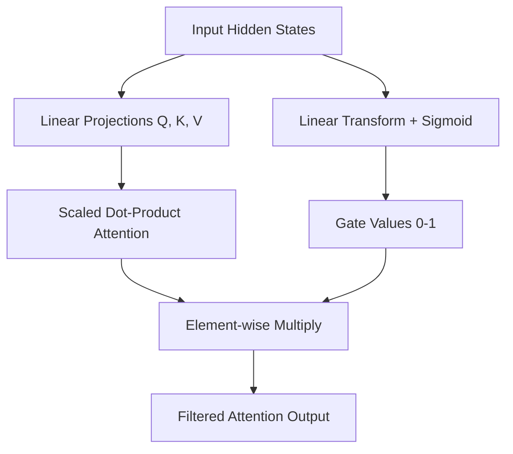

# 🧠 Gated Attention: Selective Focus in Transformers

Standard attention can sometimes be "too loud" 📢, giving weight to tokens that don't matter (like the [Attention Sink](https://arxiv.org/abs/2309.17453) problem). **Gated Attention** adds a **smart filter** 🛑 after the attention mechanism to selectively let information through.

It's essentially a **Gated Linear Unit (GLU)** applied directly to the attention output.

---

## 🔑 Intuition

*   **Standard Attention:** calculates how much every token should look at every other token.
*   **The Gate:** A separate learnable layer that looks at the input and says: "Is this attention result actually useful for the next layer?"

### Formula

$$
Output = \text{Attention}(Q, K, V) \odot \sigma(W_g X + b_g)
$$

Where:
*   $\text{Attention}(Q, K, V)$ is the standard Scaled Dot-Product Attention.
*   $\sigma(W_g X + b_g)$ is the **Sigmoid Gate** (values between 0 and 1).
*   $\odot$ is element-wise multiplication.

---

## 🖼️ Gated Attention Flow (Mermaid Diagram)



---

## 🧩 Why Use Gated Attention?

1.  **Fixes "Attention Sinks":** Softmax attention often forces models to put weight on the first token (often a period or whitespace) just because it has to put weight *somewhere*. The gate can simply "turn off" those noisy activations.
2.  **Training Stability:** By modulating the flow, it prevents massive activation spikes that usually crash training at large scales.
3.  **Better Long Context:** It helps the model ignore irrelevant tokens in massive contexts, focusing only on what matters for the current prediction.
4.  **Used in:** Modern architectures like **Gated Linear Attention (GLA)** and variants of the **Qwen** models.

---

## 🐍 Minimal PyTorch Implementation

```python
import torch
import torch.nn as nn
import torch.nn.functional as F

class GatedAttention(nn.Module):
    def __init__(self, dim):
        super().__init__()
        self.qkv = nn.Linear(dim, 3 * dim)
        self.gate = nn.Linear(dim, dim)
        self.out_proj = nn.Linear(dim, dim)

    def forward(self, x):
        b, n, c = x.shape
        
        # 1. Standard Attention Branch
        q, k, v = self.qkv(x).chunk(3, dim=-1)
        # (Simplified SDPA for demonstration)
        attn_out = F.scaled_dot_product_attention(
            q.unsqueeze(1), k.unsqueeze(1), v.unsqueeze(1)
        ).squeeze(1)

        # 2. Gating Branch
        # Decides how much of the attention output to keep
        g = torch.sigmoid(self.gate(x))

        # 3. Apply Gate
        out = attn_out * g
        
        return self.out_proj(out)
```

---

## 📚 Links to Learn More

*   🔗 [Gated Linear Attention (GLA) Paper](https://arxiv.org/abs/2312.06635)
*   🔗 [Efficient Streaming Transformers (Attention Sinks)](https://arxiv.org/abs/2309.17453)
*   🔗 [Flash-Linear Attention (FLA) Library](https://github.com/sustech-repro/flash-linear-attention)

---

**Summary**:
Gated Attention = **Attention + a Mute Button**. It lets the model decide not just *where* to look, but *if* the result of looking is worth passing on.
