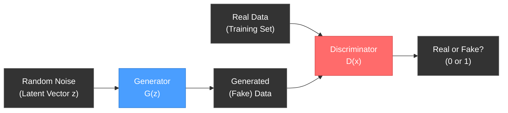
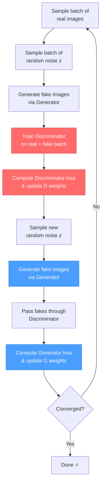

# Generative Adversarial Networks (GANs)

## Overview

A **Generative Adversarial Network (GAN)** is a deep learning framework where two neural networks — a **Generator** and a **Discriminator** — compete against each other in a minimax game. The Generator learns to produce realistic data (e.g., images), while the Discriminator learns to distinguish real data from generated (fake) data. Over time, the Generator becomes so good that the Discriminator can no longer tell the difference.

> **Introduced by**: Ian Goodfellow et al., 2014  
> **Paper**: *Generative Adversarial Nets* (NeurIPS 2014)

---

## Architecture



### Generator (G)
- **Input**: A random noise vector `z` sampled from a latent space (e.g., Gaussian or Uniform distribution).
- **Output**: A synthetic data sample (e.g., an image) that mimics the real data distribution.
- **Goal**: Fool the Discriminator into classifying generated samples as real.

### Discriminator (D)
- **Input**: A data sample — either real (from the dataset) or fake (from the Generator).
- **Output**: A probability score indicating whether the input is real (`1`) or fake (`0`).
- **Goal**: Correctly classify real vs. fake samples.

---

## Training

### The Minimax Game

GAN training is framed as a two-player minimax optimization:

$$\min_G \max_D \; V(D, G) = \mathbb{E}_{x \sim p_{data}}[\log D(x)] + \mathbb{E}_{z \sim p_z}[\log(1 - D(G(z)))]$$

Where:
- `D(x)` = Discriminator's estimate that real data `x` is real
- `G(z)` = Generator's output given noise `z`
- `D(G(z))` = Discriminator's estimate that fake data is real

### Training Steps (Per Iteration)



**Step 1 — Train the Discriminator:**
1. Sample a mini-batch of **real** images from the dataset.
2. Sample random noise `z` and generate **fake** images via `G(z)`.
3. Compute the Discriminator's loss:
   - Maximize `log D(x)` for real images (push toward 1).
   - Maximize `log(1 - D(G(z)))` for fake images (push toward 0).
4. Update `D`'s weights via backpropagation.

**Step 2 — Train the Generator:**
1. Sample new random noise `z` and generate fake images via `G(z)`.
2. Pass the fake images through `D` (but **freeze D's weights**).
3. Compute the Generator's loss:
   - Minimize `log(1 - D(G(z)))`, or equivalently maximize `log D(G(z))`.
4. Update `G`'s weights via backpropagation.

### Key Training Tips
- **Alternate training**: Train D for `k` steps, then G for 1 step (commonly `k=1`).
- **Label smoothing**: Use `0.9` instead of `1.0` for real labels to improve stability.
- **Learning rate**: Use a small learning rate (e.g., `2e-4`) with Adam optimizer.
- **Batch Normalization**: Helps stabilize training in both G and D.

---

## Inference

Once training converges, only the **Generator** is needed for inference:

1. Sample a random noise vector `z` from the latent space.
2. Pass it through the trained Generator: `output = G(z)`.
3. The output is a synthetic data sample (e.g., a generated image).

> The Discriminator is discarded after training — it was only needed to teach the Generator.

```
Inference Pipeline:
    z ~ N(0, 1)  →  Generator G(z)  →  Generated Image
```

---

## Common Challenges

| Challenge | Description | Mitigation |
|-----------|-------------|------------|
| **Mode Collapse** | Generator produces limited variety of outputs | Mini-batch discrimination, unrolled GANs |
| **Training Instability** | Loss oscillates, doesn't converge | Spectral normalization, gradient penalty |
| **Vanishing Gradients** | Discriminator becomes too strong too fast | Use Wasserstein loss (WGAN), label smoothing |
| **Evaluation** | Hard to quantitatively measure output quality | FID score, Inception Score |

---

## GAN Variants

| Variant | Key Idea |
|---------|----------|
| **DCGAN** | Uses deep convolutional layers instead of fully connected |
| **WGAN** | Uses Wasserstein distance for more stable training |
| **CGAN** | Conditional generation based on class labels |
| **StyleGAN** | Style-based generator for high-res face synthesis |
| **CycleGAN** | Unpaired image-to-image translation |
| **Pix2Pix** | Paired image-to-image translation |
| **ProGAN** | Progressively grows resolution during training |

---

## Applications

| Domain | Application | Example |
|--------|-------------|---------|
| **Computer Vision** | Image generation | Generating photorealistic faces (StyleGAN) |
| **Computer Vision** | Super-resolution | Enhancing low-res images (SRGAN) |
| **Computer Vision** | Image inpainting | Filling in missing regions of images |
| **Healthcare** | Medical imaging | Synthetic CT/MRI scans for data augmentation |
| **Art & Design** | Style transfer | Turning photos into paintings |
| **Gaming** | Texture generation | Creating game assets procedurally |
| **NLP** | Text generation | SeqGAN for sequence generation |
| **Audio** | Speech synthesis | WaveGAN for raw audio generation |
| **Security** | Deepfakes | Face swapping in video (and detection) |
| **Data Augmentation** | Synthetic data | Generating training data for rare classes |

---

## Summary

- GANs consist of two networks (Generator & Discriminator) trained adversarially.
- The Generator learns to produce realistic data; the Discriminator learns to detect fakes.
- Training alternates between improving D and G until equilibrium.
- At inference, only the Generator is used — sample noise → get output.
- GANs are widely used for image generation, data augmentation, style transfer, and more.
